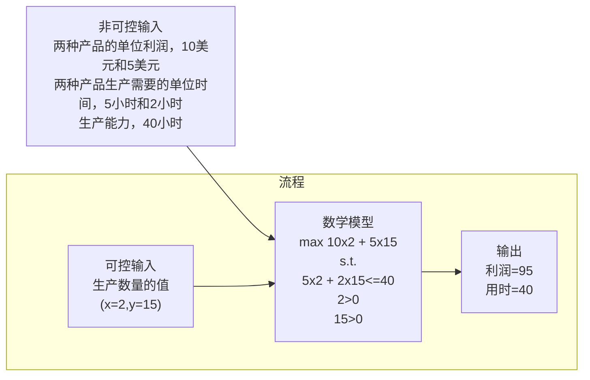

# 第一章 导论

> 管理科学，一种基于科学方法的决策工具，大量使用定量的分析方法。也叫：`运筹学`,`决策科学`

- 1982年，托马斯 M.库克（Thomas M.Cook）,美国航空公司

## 1.1 解决问题与制定决策

> `解决问题`(problem solving)：一个识别实际问题与期望状态之间的差异d的过程。

这一个过程包括7个步骤：

- 识别与定义问题。
- 确定备选方案集。
- 确定一个或一组用于评价备选方案的标准。
- 评价备选方案。
- 选择一个方案。
--- 
- 实施选定的方案。
- 对实施结果进行评估，以确定问题是否得到满意解决。

> `制定决策`(decision making): 决策过程从识别定义问题开始，到选择确定方案截止。

> `单准则决策问题`(single-criterion decision problem): 只需要根据一个标准来选择最优方案的问题。

> `多准则决策问题`(multicriteria decision problem): 多于一个标准的决策问题。

这里将解决问题的前5步归为 `制定决策` ，最后选择了一个方案称为 `决策`。

## 1.2 定量分析与制定决策

另一种将`制定决策` 分类的方式：

- `将问题结构化`包括：定义问题->识别备选方案->确定标准

- `分析问题`包括：评价备选方案->选择一个方案

  分析问题的两种方式：`定性分析`和`定量分析`


为何定量方法可以用于决策过程：

1. 问题很复杂，管理者在没有定量分析的帮助下不能给出一个好的解决方案。
2. 问题特别重要，且管理者在尝试做决策前希望有一个全面的分析。
3. 新遇到的问题，管理者事先并没有从何处下手的经验。
4. 重复性问题，管理者依靠定量处理来节约时间和精力，以做出常规决策的建议。

## 1.3 定量分析

> 分析人员对问题的结构化过程参与的越深入，`定量分析`对决策过程的贡献就可能越大

设计的角色：

- 管理科学家
- 管理者/用户

> 问题结构化后，可以开始`建模`-从数学上反映我们研究的问题。

 - 方案处理过程就可用于为模型找到最好的解决方案。

 - `建立和解决`模型的过程是定量分析过程的`核心环节`。

### 1.3.1 建模

> `模型`(model) 是实际对象或情景的一个反映，他可以以各种形式表达出来。

 - `形象模型`(iconic model) 表示物理复制(e.g. 飞机的比例模型)。

 - `模拟模型`(analog model) 一种物理模型，但是在外形上同被建模的对象并不一样。（e.g.汽车上的速度仪表盘，是对汽车速度的一种模拟模型）

 - `数学模型`(mathematical model) 使用系统化的符号和数学表达式或关系来反映实际问题。

```
//P表示总利润，x表示出售的单位数，每单位利润是10美元
P = 10x
```

> 所有模型的目标或价值就是它让我们可以通过研究和分析模型来对现实状态做一个推理。

- 更便宜
- 可以减少真实情景的风险

> 模型分析所得到的结论或决策价值取决于模型描述实际情况的程度。正比关系

数学建模的定量分析方式

1. 问题定义阶段，确定目标和`约束条件`(constraint), 比如 利润最大化的目标，企业生产能力的上限。

2. 定量分析方法和数学模型是否成功，关键在于建立起来的数学关系式能否准确的描述这个问题的目标以及他的约束条件。

> `目标函数`(objective function),用来描述一个问题的目标的树小表达式。

例子

```
//最大化利润，目标函数，x表示产品数量，单位产品利润为10
P = 10x 

//40为总工作时间，5为生产单位产品需要的时间
//这里就构成了一个约束条件
5x<=40
x>=0

// 根据约束条件可以算出 x=8 是最优解
```

> `非可控输入`(uncontrollable input),能够影响目标函数和约束条件的环境因素，这些因素并不受管理者和决策者控制。(e.g. 例子中的单位产品利润，单位产品生产时间以及总生产能力)

> `可控输入`(controllable input),可以被管理者和决策者控制的因素。(e.g. 例子中的生产数量 x)-也叫 `决策变量`

> `确定模型`(deterministic model),指模型中的非可控输入都是已知的，不可变的。

> `随机模型`(stochastic model)or `概率模型`(probabilistic model), 指模型中的非可控输入是不确定的，变化的。

### 1.3.2 数据准备

> 这里的数据指的是非可控输入的值。我们对模型进行分析并对问题提供决策或方案的建议之前，所有非可控输入必须确定下来。

往往在建模阶段，非可控输入是不知道的，这时候会用符合表示

上面那个例子，在建模阶段应该是下面这样的：

```
//目标：max cx.
P = cx

//约束条件 
ax<=b
x>=0
```

> 数据准备阶段的工作就是 确定 c,a 和 b 的值

### 1.3.3 模型求解

> 完成了建模和数据准备，那么就需要对模型进行求解了，此阶段将确定决策变量的具体值，以获得`最优解`(optimal solution)。

求解的方法有

- 反复试验法
- 

> `不可行解`(infeasible solution), 指的是方案不满足其中一个或多个约束条件。

> `可行解`(feasible solution), 满足所有约束条件，是最优解或决策建议的一个候选项。


### 1.3.4 报告编写

> 报告内容要建立在模型解答的基础之上。

### 1.3.5 实施中需要注意的问题

> 改变总会招来抵制，而让用户参与建模和决策有助于用户理解改变的原因，调动用户改变的积极性，让决策实施更顺利。


## 1.4 成本、收益与利润模型

### 1.4.1 成本数量模型

> `固定成本`(fixed cost),是总成本中不随产量变化的那部分成本。(e.g. 产品的开模成本，生成多少件也只要开一次模)

> `可变成本`(variable cost), 随产量的变化而变化的成本。(e.g. 每件产品需要消耗的原料,生成的越多消耗的越多)

例子

```
//x-生成的数量
//3000 开模成本
//2-单件成本
C(x) = 3000 + 2x
```

> `边际成本`(marginal cost) 是指总成本随产量变化的变化率。(e.g. 多生产一件产品，总成本的增加量，在上面的例子中 边际成本就是 2。当然也有生产的越多拿到的价格可以月底的情况。)

### 1.4.2 收入数量模型

> 用于计算卖出一定数量的产品时，公司可以获得多少预期收入。

例子

```
//x-表示销量
//5-是售价
//R(x)-就是销售x件产品的收入
R(x) = 5x
```

### 1.4.3 利润数量模型

> 利润数量模型可以由收益数量模型和成本数量模型得出

例子

```
//P(x)-总利润=总收入-总成本
P(x) = R(x)-C(x)
= 5x-(3000+2x)
= -3000+3x
```

### 1.4.4 盈亏平衡分析

根据上面的利润公式

```
P(x) = -3000 +3x
```

> 可以计算出至少要生产 1000 件产品才能盈亏平衡。这个值叫 `盈亏平衡点`(breakeven point)

## 1.5 管理科学技术

- `线性规划`(linear programming)

- `整数线性规划`(integer linear programming)

- `网络模型`(network model)

- `项目计划`(project scheduling:PERT/CPM)

- `库存模型`(inventory model)

- `等候线或排队模型`(waiting line or queueing model)

- `模拟`(simulation) 

- `决策分析`(decision analysis)

- `目标规划`(goal programming)

- `层次分析法`(analytic hierarchy process)

- `预测`(forecasting)

- `马尔可夫过程模型`(Markov process model)

- `动态规划`(dynamic programming)


## 本章小结

> 数学模型是现实世界的抽象，不可能穷尽所有因素，我们需要的是抓住问题的关键，提出可行方案，让模型对决策有帮助。

> 管理科学一个越发明显的特定是努力寻找最优解。

## 习题

### 第八题 

> 在1.3的例子中假设公司要生成第二种产品，单位利润是5，单位制造时间是2用y 表示。

- a. 考虑同时生产两种产品，写出数学模型

```
//第一种产品
//目标max P(x)-利润最大化
P(x) = 10x

//s.t. 限制条件
5x<=40
x>=0

//第二种产品

P(y) = 5y

//s.t.
2y<=40
y>0

//同时生成第一种和第二种

P(x,y) = 10x + 5y

//s.t.
5x + 2y<=40
x>0
y>0

```

- b. 确定该模型中的可控和非可控输入

```txt
可控输入:
第一种产品的产量 x, 第二种产品的产量 y

非可控输入：
两种产品的单位利润，10美元和5美元  
两种产品生产需要的单位时间，5小时和2小时  
生产能力，40小时
```

- c. 划出该模型的输入输出流程图



- d. x和y的最优解是多少

```txt
x 每小时的利润是 2  
y 每小时的利润是 2.5  
所以应该全部生产y, 现在要两种都生产那么应该只生产一个x,其他的全部是y, 也就是 y 生产 17.5个，按17个算
//要求 max P(x,y)
P(x,y) = 10x + 5y

//当x=1,y=17时，有最大值,并用时最少39
P(x,y) = 10 + 85 = 95
```

- e. 在a中所求的这个模型是确定模型还是随机模型？请解释。

```txt
a中所求的模型为确定模型，因为所有的非可控输入都是确定的，不可变的。
```

### 第十题

> A 地一家零售商店甲收到了从B地和C地运来的货物。假设x表示从B地发来的货物量，y 表示从C地发来的货物量。

- a. 写出该零售商店所收到的单位产品总数的表达式。

```txt
P(x,y) = x + y
```

- b. 从B地运出的运费是每单位0.20美元，而从C地运出的运费是每单位0.25美元。写出到该零售商店的总运费的目标函数。

```txt
C(x,y) = 0.2x + 0.25y
```

- c. 假设该零售商店每月的需求是5000单位的产品，写出要把5000单位产品运送到该店的约束条件。

```txt
x + y >= 5000
```

- d. 在一个月中，从B地运出的货物不超过4000单位，而从C地运出的不超过3000单位。写出模拟这个情况的约束条件。

```txt
s.t.
x + y >= 5000
x <= 4000
y <= 3000 
```

- e. 当然，货物量是负数时是不能运送的。请结合目标函数以及约束条件，写出满足该零售商店需求的成本最低的数学模型。

```txt
Min C(x,y)
C(x,y) = 0.2x + 0.25y

s.t.
x + y >= 5000
x <= 4000
x >= 0
y <= 3000 
y >= 0

B第运送的价格更便宜，所以要成本最低，应该尽可能从B地运送，B地可运送的满额是 4000，总共需求需要 5000，所以需要从 C 地运 1000

C(x,y) = 0.2 x 4000 + 0.25 x 1000 = 1050
```

### 第十二题

> 如果订单规模大到可以带来合理的利润，O'Neill制鞋厂将会生产一种特殊型号的鞋子。对于每一个特殊型号的订单，在生产设备上公司都会花费1000美元的固定成本。每双鞋的可变成本是30美元，售价是40美元。

- a. 用x表示生产了多少双鞋，写出生成x双鞋的总成本的数学模型。

```txt
C(x) = 1000 + 30x
```

- b. 用P表示总利润，写出一个订购x双鞋的订单所能带来的总利润的数学模型。

```txt
P(x) = 40x - C(x) = 40x - 1000 - 30x
= 10x - 1000
```

- c. 在 O'Neill鞋厂达到盈利平衡前，鞋的订单规模应该达到多大？

```txt
P(x) = 10x - 1000
盈亏平衡 
10x - 1000 = 0
x = 100
```

### 第十四题

> Eastman 出版公司正在考虑出版一本关于电子数据表在商业上的应用的平装版教科书。估计原稿准备、教科书设计以及生产设备的固定成本是80000美元，每本书可变的生产和原料成本估计是3美元，对书的需求估计是4000册。该公司想以每本书20美元的价格卖给大学和学院的书店。

- a.盈亏的平衡点是多少？

```txt
P(x) = 20x - 3x - 80000
= 17x - 80000

P(x) = 17x - 80000 = 0
x = 4750.88
```

- b.需求是4000册时，预期利润或损失是多少？

```txt
P(x) = 17x - 80000
x = 4000
P(x) = 17x4000 - 80000
= -12000
```

- c.需求是4000册时，为了达到盈亏平衡，该公司应卖的最低单价是多少？

```txt
设单价为a
P(x) = (a-3)x4000 - 80000 = 0

a = 23
```

- d.单价可增长到25.95美元，且不会影响4000册的需求，应该采取什么样的行动最好？预期利润或损失是多少？

```txt
最好的行动是按最高价 25.95出售

P(x) = (25.95-3)x4000 - 80000
= 11800

预期利润为 11800
```

### 第十六题

> 一名投资公司客户有 80000 美元资产，需要从下面两个股票中选择投资

|股票|每股价格|每股最大<br>年化收益(美元)|可投资额度|
|--|--|--|--|
|OA|50|6|50000|
|SP|30|4|45000|

令x表示OA的股份数，y表示SP的股份数。

- a.假设客户希望最大化总的年化收益，则目标函数是?

```txt
目标行数：max P(x,y)
P(x,y) = 6x + 4y
```

- b. 写出在下面3个约束条件下的每一个的数学表达式：

```txt
s.t.
(1)总的投资基金是80000美元
50x + 30y <= 80000

(2)对OA的最大投资是50000美元
50x <= 50000

(3)对SP的最大投资是45000美元
30y <= 45000
```

### 案例1-1

> 18对选手，要在接下来的17周中两两进行比赛，当前是比赛前一天需要安排日程。有一对选手需要明天下午1点确定是否取消比赛

要输出管理报告

(1)比赛日程安排
(2)如果那一对选手第二天确定取消比赛的备用安排

```txt
18对选手两两比赛，一共需要比 17+18+16···+1 = 153
17周，共 119 天，平均每天要进行 1.3场比赛，也就是有30%的天数进行两场比赛就可以满足要求了。
```


## 附录

[附录Excel表](res/plus_excel.xls)

```txt
wps what-if Analysis 菜单，在 数据-模拟分析 菜单中
```